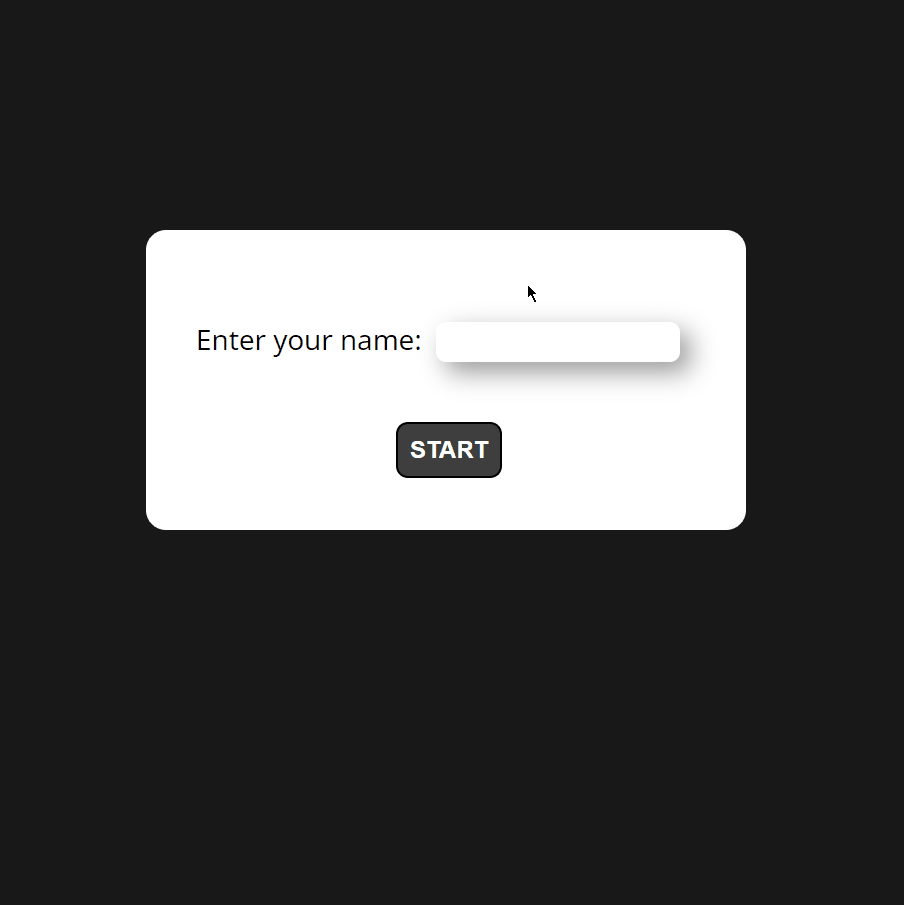

# Tic-Tac-Toe

Classic Tic-Tac-Toe game built with VanillaJS. [Play the game.](https://pages.git.generalassemb.ly/gkken/tic-tac-toe/)

## Demo



## Features

- Classic tic-tac-toe rules
- Play against a CPU that is capable of defending when player is about to win and making the winning move, where possible
- Allows for user to pick their name (Defaults to 'PLAYER' if left blank)
- Scoreboard to display the score of player and CPU score and tie counter
- Play multiple matches without resetting scores or tie counter

## Getting Started

These instructions will get you a copy of the project up and running on your local machine for development and testing purposes.

### Prerequisites

You will need to have [Node.js](https://nodejs.org/) installed.

### Running the Game

Navigate to the folder and type in the following command:

For Windows:

```
explorer.exe index.html
```

For Mac:

```
open index.html
```

## To be implemented

- Option to set how many scores to play to
- Option to customize player's mark
- Implement LocalStorage or SessionStorage to persist data locally to allow games to continue after page refresh or loss of internet connectivity
- Implement a more elegant solution for display player/CPU marks
- Animation for resetting board
- Animation for placing a mark
