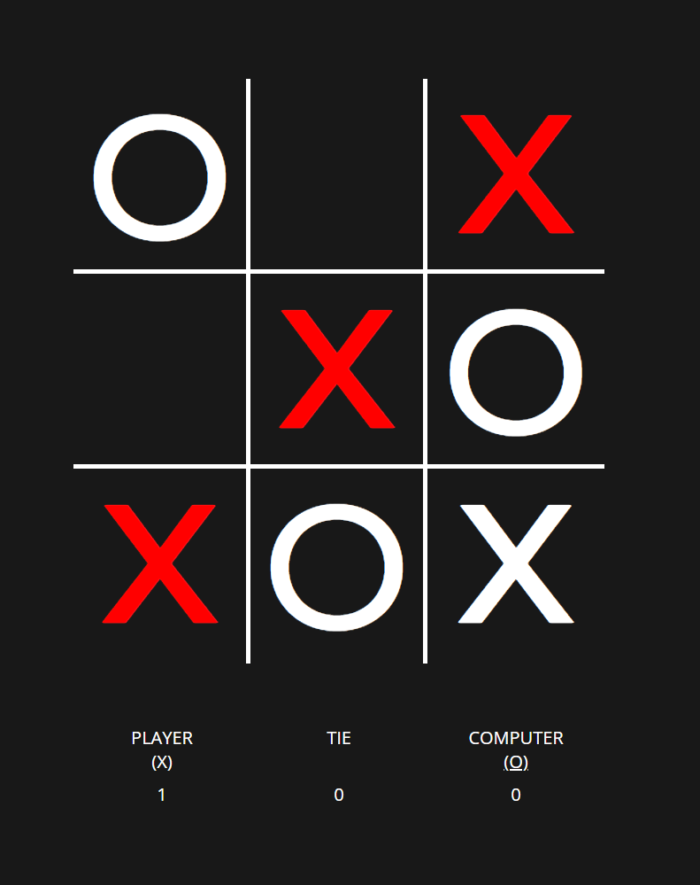

# Tic-Tac-Toe: Javascript, HTML, CSS

Tic-tac-toe game designed with JavaScript, HTML, CSS and animations from Animista.

## Features

- Classic tic-tac-toe rules
- Go up against a more sophisticated CPU that defends when player is about to win and makes the winning move, where possible
- Allows for user to pick their name (Defaults to 'PLAYER' if left blank)
- Scoreboard to display player and CPU score as well as a tie counter
- Play multiple matches without resetting scores or tie counter
- Different visuals for drawing and winning/losing

# Screenshot

## To be implemented

- Option to set a winning score
- Option to customize player's mark
- LocalStorage or SessionStorage to persist data locally to allow games to continue after page refresh or loss of internet connectivity
- Fix a bug whereby player can still continue to play the game once round has ended
- Implement a more elegant solution for display player/CPU marks
- Animation for resetting board
- Animation for placing a mark

# Approach Taken

This section is to be read together with the logic flowchart.

## Start game

- Initial screen to allow for player to pick a custom name if desired
- If left blank, name will default to 'PLAYER'
- The `startGame()` function will be triggered once player clicks `START` and an animation will play for the initialization for the board

## Player makes a move

- Player makes a move by clicking on a box
- The `checkEmptySquare()` function will check whether the box selected by player is empty.
- If yes, the box dataset will be changed to `'human'` and a `X` will be displayed at the selected box
- If no, nothing will happen

## Is the board full?

- Iterates over all boxes of the board and checks whether all dataset of box is not empty (i.e. dataset all boxes has been changed to either `'human'` or `'CPU'`)
- If yes, board is full

## Did someone win?

- Uses a variable that stores all winning combinations in the form of a nested array, `winningLinesArr`
- The `detectWinner()` function iterates through `winningLinesArr` and checks whether any of the winning combinations has 3 human marks or CPU marks
- If yes, returns the approriate winner, else returns `undefined`
- Another helper function `someoneWon()` which returns the return value of `detectWinner()` as a boolean (i.e. `return !!detectWinner()`)

## CPU makes a move

- CPU's logic works as follows:
  - If there is a winning move, make the winning move
  - Else, if player is one move away from winning, block player
  - Else, if center square is available, take center square
  - Else, pick a random empty square (empty square determined by `checkEmptySquare()` function)

### How to determine winning / 'at-risk-square'?

- The `findAtRiskSquare()` function iterates through `winningLinesArr` and checks whether any of the winning possibilities have at least 2 boxes marked with `'human'`
- If yes, identifies the remaining unmarked box to be picked
- In finding the winning move, the `findAtRiskSquare()` function is also used, except it is now looking to see whether any of the winning possibilities have at least 2 boxes marked with `'CPU'`

## Display marks

- Marks are essentially texts
- When a mark is to be placed, the relevant `X` or `O` is added to the div and the relevant classList is also added to the selected div
- The relevant classList would apply the styling to display the `X` and `O`

## Incrementing counter/scores

- Use variables such as `playerScore`, `computerScore` and `tieCounter` to keep track of these information and update when appropriate

## Reset

- Invisible overlay will appear over the board, wherein if player clicks anywhere in the board, the board will be resetted
- Resetting involves clearing classes from divs which were applied in the `Display marks` step above.
